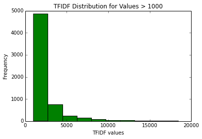

# Machine Learning with MongoDB and Python

### Introduction

In marketing organizations there is great demand for predictive analytics about
customer behavior.  Machine learning methods, which require high quality
predictive variables, are being applied to this task today.   While marketing
organizations have access to their own records, predictive analytics can be made
more effective by using additional variables found on the Web.  For example,
potential customers from certain industries may be more desirable and more
likely to buy than others. Thus, analyzing web data to categorize websites by
industry has potential value.

This project is a proof of concept illustrtraing how to integrate Amazon Elastic
MapReduce, MongoDB and Python to do machine learning on large data sets. In this
project, I use the web data from the Common Crawl Corpus, a web archive with
over 200 TB of archived data. Text from a sample of the Corpus are processed
with Amazon Elastic MapReduce into a JSON file for import into MongoDB.  The
text is further processed into a format suitable for use in predictive analytics
using Mongo and Python. Using a sample from the Mongo database, Python
classifiers are used to train a model for predicting the probability that a site
is a .gov site.  Any suitable industry target variable could be used, but ground
truth for .gov sites is trivial to acquire.  Model-generated coefficients are
exported to Mongo and a final Mongo mapReduce process applies the coefficients
to the entire Mongo database creating a prediction for each domain.

### Common Crawl Corpus Import

The initial step requires converting CCC files into a JSON file for import into
MongoDB. Since the CCC is available on Amazon's S3 service, Elastic Map Reduce
is a convenient way to process the data. The CCC is archived several times a
year and comprises several types of archive files.  Here, I used the .WET files
which contain some meta information and text extracted from the site's HTML.
For example:

<pre>
WARC/1.0
WARC-Type: conversion
WARC-Target-URI: http://0pointer.de/photos/?gallery=Avoriaz%202011-01&photo=495
WARC-Date: 2014-03-07T03:55:34Z
WARC-Record-ID: <urn:uuid:d1876142-af83-4d0c-a326-0dc8806464ac>
WARC-Refers-To: <urn:uuid:ef47b3f3-fc9b-4f20-9fba-972ca78f9c49>
WARC-Block-Digest: sha1:TVRQJUSJQ256Y27JWHD3ZMEQSDXCBXCR
Content-Type: text/plain
Content-Length: 634

Photos
[ style: dark classic gorilla ]
Photo Gallery
Photo Gallery Index
> Avoriaz, France12
> Photo 495
Previous
Next
2011/01/13 10:24:14 | Canon | Canon EOS REBEL T2i | 300mm | f/6.3 | 0.1/32s |
ISO100 | 16 | display table
Photo 495
This image has been viewed 433 times.
MQ Post a Comment:
[ Show FormHide Form ]
Name:
Remember Name:
9767
Retype PIN Above:
Comment:
< Previous
Next >
All Panoramas | Special Photo Series | Lennart's Blog | Lennart's Homepage |
Lennart's Photos | Impressum/Imprint
Lennart Poettering <mzcubgb (at) 0pointer (dot) net>
</pre>

For use in machine learning applications, the data will be needed in a sparse
matrix format with rows representing web sites and columns representing words
used on the site. Each word on a site is associated with a score indicating its
importance as an identifier for the site. The score employed is called the term-
frequency inverse-document-frequency (tfidf).  There are several steps needed to
get from the CCC files to a useful tfidf representation of the data.

1. Map Reduce on Amazon

The CCC files are text files stored in compressed format.  After decompressing
with gzip, they are processed with Hadoop Streaming using a python mapper
(mapWET2_emr.py) and reducer (reduceWET2_emr.py).  Additionally, the map reduce
job passes each word through a filter which checks for english words using a
298k english word dictionary, eliminates common words (stop words) and converts
words to a root form (stem). The map reduce results in this format:

{_id:stem@domain, value:stem_frequency_in_domain}

The uncompressed WET files used here were 5.6 GB.  Processing took ~35 minutes
using 20 cores. Cost was less than $2. There is no intrinsic limit to processing
10 times or 100 times as much data.  Importing the JSON file into Mongo on an
EC2 m3large instance took 23 minutes.   The stats on this file produced by Mongo
are:

<pre>
> db.test.stats()
{
        "ns" : "ccc.test",
        "count" : 21824244,
    "size" : 1351247832,                  (Note: 1.35 GB storage size)
        "avgObjSize" : 61.914989220245154,
        "storageSize" : 2148970496,
        "numExtents" : 22,
        "nindexes" : 1,
        "lastExtentSize" : 560447488,
        "paddingFactor" : 1,
        "systemFlags" : 1,
        "userFlags" : 0,
        "totalIndexSize" : 1601081552,
        "indexSizes" : {
                "_id_" : 1601081552
        },
        "ok" : 1
}
</pre>

### Processing Steps Using Mongo, Python and Javascript

The additional processing steps to convert the  initial JSON file into a file
with tfidf values are:

- getWordFreq.py - read from Mongo, create row and col indices. count number of
unique documents. Insert results back to Mongo {_id:obj, stem:stem
, value:col_idx} 
{_id:object,domain:domain, value:row_idx}
 
{_id:object, n_rows:n, n_cols:m}
- tfidf_step2.js - Mongo map reduce; find number of docs in which stem occurs
 {"_id" : stem "value" : number_of_docs_in_which_stem_occurs }
- tfidfStep3.js - compute inverse document frequency   { "_id" : stem,
"value" : idf}
- tfidfStep4.js - compute tfidf value from Step3 and initial map reduce results
 { "_id" : stem@domain, "value" : tfidf}
- formatStep5.js - reformat to simplify for summary analytics in Mongo. Also
serves as format for python classification job to come.
 
{
        "_id" : stem@domain,
        "value" : {
                "domain" : domain,
                "word" : word,
                "tfidf" : tfidf
        }
}
 
- tfidfStep6.js -  mapper reducer for converting to format with all data for a
domain in one document
result: 
{ "_id" : domain, "value" : {"payload":  [{ word:word1, tfidf:tfidf} ... ]}

Details on step6_results for 93499 web sites are here:

<pre>
> db.step6_results.stats()
{
        "ns" : "ccc.step6_results",
        "count" : 93499,
        "size" : 948295432,
        "avgObjSize" : 10142.305607546605,
        "storageSize" : 1165967360,
        "numExtents" : 16,
        "nindexes" : 1,
        "lastExtentSize" : 307515392,
        "paddingFactor" : 1,
        "systemFlags" : 1,
        "userFlags" : 0,
        "totalIndexSize" : 4635792,
        "indexSizes" : {
                "_id_" : 4635792
        },
        "ok" : 1
}
</pre>

With tfidf values assigned to all words for all sites, the data is ready for use
in classification.  The steps in the classification process are:

- tfidfStep7.js - split db into .gov and non .gov sites in preparation for
sampling and classification training in Python. No format change but 2 databases
produced.Result: 
{ "_id" : domain, "value" : {"payload":  [{ word:word1, tfidf:tfidf} ... ]}
- extract_ccc.ipytnb ipython notebook code that extracts sample data set from
step7_results collection and saves as python .pickle file
- classification Using previoulsy developed code, run Random Forest for feature
selection and Logistic Regression with L1 Regularization to train model.  Result
is a set of coefficients for the most predicitve stems.
- saveCoef.py saves the python generated stem:coefficient in the lr_coef
collection.

The final step in the flow uses the Mongo engine to apply the model-generated
coeficients to the entire data set to make predictions about all 93499 websites.
The coefficients are saved in the lr_coef collection and then apply_coef6.js is
used to compute the probability that a site is a .gov site.  The apply_coef6.js
code uses Mongo mapReduce which is marginally faster, with this data set, than
using javacsript to loop over the elements of the db:

- applyCoef_step6.js  apply the lr_coef to the step6_results collection.  This
is a map reduce that multiplies the tfidf value for each stem by it's respective
coefficient and sums over all values.  A finalize step is used to convert the
summed coefficients to a probability using a logistic transform. step8_final
collection result: 
{ _id:domain, value:probability_of_gov_site}

Running apply_coef6.js takes 6m 23s for prediction on the 93499 website set.
The code is here:

<pre>
/*
applyCoef_step6.js
muliply tiidf values by coef if it exists
sum  tfidf values by site and apply logistic function to make yhat
result:
{ "_id" : domain, "value" : yhat}

 */

con = new Mongo();
db = con.getDB("ccc");
db.step8_final.drop();

coef_data = db.lr_coef.find().toArray()[0]
coef = coef_data.value
beta0 = coef['%BETA0%']

mapper = function() {
    domain = this._id
    payload = this.value['payload']
    payload.forEach ( function (x) {
        if ( coef[x.word] != null) {
             tfidf=  x.tfidf
             partial_sum = tfidf*coef[x.word]  // compute weighted partial sums
             emit(domain,  partial_sum)
        }
    })
};

reducer = function(domain, partial_sums){
     yhat  =  Array.sum(partial_sums)            // sum partial sums
     return (domain, yhat);
};

finalize = function(domain, yhat) {
        betax  = beta0 + yhat
        yhat = 1/(1 + Math.exp(-betax))  //apply logistic transform to convert
to probabilities
        return ( yhat)
};

db.step6_results.mapReduce(
    mapper,
    reducer,
    {
        out : "step8_final",
        sort: { _id: 1},
        scope: {
            coef:coef,
            beta0:beta0
        },
        finalize : finalize
    }
 );
</pre>

Running all Mongo steps on the corpus takes ~160 min on a single machine. Final
storage for the database including intermediate collections is 35GB. Details on
step8_final results for 85673 web sites are here:

<pre>
> db.step8_final.stats()
{
        "ns" : "ccc.step8_final",
        "count" : 85673,
        "size" : 5102048,
        "avgObjSize" : 59.552577824985704,
        "storageSize" : 12574720,
        "numExtents" : 6,
        "nindexes" : 1,
        "lastExtentSize" : 9437184,
        "paddingFactor" : 1,
        "systemFlags" : 1,
        "userFlags" : 0,
        "totalIndexSize" : 4235168,
        "indexSizes" : {
                "_id_" : 4235168
        },
        "ok" : 1
}
</pre>

### Data Set Characteristics

#### Words Per Site

The number of words per site is frequently an indicator of the utility of the
data. A dataset with this information was created by running the following
aggregation framework command in the mongo shell:

docs = db.step5_results.aggregate( [ { $group: { _id: "$value.domain", count:
{$sum:1}}},
                                                           { $project: { _id:0,
domain:"$_id", count:1}},
                                                           { $sort : { count:
-1}}
                                     ])
db.words_per_site.insert(docs)

Summary stats and histogram of the results using python:

    from pymongo import MongoClient
    client = MongoClient()
    db = client.ccc
    
    docs = db.words_per_site.find()
    for d in docs:
        maps =d['result']
    word_count_map = {}
    for d in maps:
        word_count_map[d['domain']]=d['word_count']
    counts = word_count_map.values()
    print "Words Per Site Summary"
    print "Number of Sites %s" % len(counts)
    print "Min %s" % min(counts)
    print "Max %s" % max(counts)
    m = mean(counts)
    s = std(counts)
    print "Mean %s" % m
    print "Std dev %s" % s
    plot_values = [ x for x in counts if x < m + 3*s] #plot up to mean + 3*std
    bins = range(1,int(m+3*s),100)
    pyplot.figure(1)
    pyplot.hist(plot_values,bins,color="green")
    pyplot.title('Words Per Site')
    pyplot.xlabel('Words Per Site')
    pyplot.ylabel('Number Sites')
    pyplot.show() 

    Words Per Site Summary
    Number of Sites 93499
    Min 1
    Max 34129
    Mean 233.416870769
    Std dev 472.039210753

#### TFIDF Distribution

Classfication accuracy depends on the tfidf scores.  High values indicate words
that are highly correlated
with a specific web site.  The sites and words with tfidf values greater than
1000 were selected in Mongo with:

<pre>
docs = db.step5_results.aggregate( [  { $project : { _id:0, domain:
"$value.domain",
                                                     word: "$value.word",
tfidf:"$value.tfidf"}},
                                       { $match: { tfidf: { $gte: 1000}}},
                                       { $sort : { tfidf: -1}}
                                   ])
db.best_tfidf.insert(docs)
</pre>

Processing with Python

    docs = db.best_tfidf.find()
    for d in docs:
        maps =d['result']
    domain_word_list = []
    for d in maps:
        domain_word_list.append( (d['domain'], d['word'],d['tfidf']))
    counts = [ x[2] for x in domain_word_list]
    print "TFIDF Summary"
    print "Min %s" % min(counts)
    print "Max %s" % max(counts)
    m = mean(counts)
    s = std(counts)
    print "Mean %s" % m
    print "Std dev %s" % s
    plot_values = [ x for x in counts if x < m + 3*s] #plot up to mean + 3*std
    bins = range(1,int(m+3*s),100)
    pyplot.figure(3)
    pyplot.hist(plot_values,color="green")
    pyplot.title('TFIDF Distribution for Values > 1000')
    pyplot.xlabel('TFIDF values')
    pyplot.ylabel('Frequency')
    pyplot.show() 

    TFIDF Summary
    Min 1000.4182446
    Max 214755.156172
    Mean 2757.29560732
    Std dev 5229.41128013

This data set has only 6299 entries implying that most of data set has values
less than 1000. Usually it is best to omit the lowest quartile or so in the
classification process. Here are the top 50 TFIDf values:

    highest_tfidf = sorted(domain_word_list,key=lambda x: x[2],reverse=True)
    print "Top 50 TFIDF scores"
    print "Word\t\tDomain\t\t\tTFIDF"
    for w in highest_tfidf[0:49]:
        print "%s\t\t%s\t\t%s" % (w[1],w[0],w[2])

    Top 50 TFIDF scores
    Word		Domain			TFIDF
    pfx		http://www.fangraphs.com		214755.156172
    fig		http://www.google.com		131884.365891
    cartridg		http://main.cricut.com		114158.51707
    cartridg		http://www.cricut.com		76117.43156
    embodi		http://www.google.com		75422.3700535
    gt		http://sourceforge.net		71446.2857858
    function		http://www.americanpoems.com		62847.6372961
    wherein		http://www.google.com		62182.322807
    vs		http://www.virgin-atlantic.com		50088.62514
    clicki		http://www.democracynow.org		48233.1909648
    said		http://www.google.com		47878.977437
    de		http://www.archive.org		47143.9001569
    data		http://www.google.com		46683.5214381
    devic		http://www.google.com		45275.8191731
    compris		http://www.google.com		44079.216652
    signal		http://www.google.com		43419.7680414
    system		http://www.google.com		40828.4544753
    od		http://www.stankiewicze.com		39234.2945916
    apparatu		http://www.google.com		38979.9273735
    cartridg		http://cricut.com		38091.4577101
    substrat		http://www.google.com		34362.246583
    control		http://www.google.com		33719.9243537
    productid		http://www.concordextra.com		32277.5738336
    claim		http://www.google.com		30885.8869518
    plural		http://www.google.com		30724.9385432
    portion		http://www.google.com		30595.4538303
    surfac		http://www.google.com		30328.7540317
    r		http://sto-forum.perfectworld.com		30127.454809
    process		http://www.google.com		29485.2866736
    et		http://www.archive.org		28592.1613083
    gt		http://www.kegg.jp		27264.2836821
    nude		http://celebritiesstalker.com		27199.3205401
    guru		http://mimanusaci.wordpress.com		27119.8783361
    exampl		http://www.google.com		26857.9540365
    reg		http://infokutuju.blogspot.com		25862.6786832
    von		http://www.monetas.ch		25750.3382955
    pt		http://www.tonermax-alaska.com		25484.1452309
    circuit		http://www.google.com		24872.9710498
    coop		http://nc-climate.ncsu.edu		24701.2281535
    widget		http://www.democracynow.org		24191.6910325
    second		http://www.google.com		23788.1894016
    shown		http://www.google.com		23197.4485022
    duel		http://www.animenewsnetwork.com		23099.6608082
    oper		http://www.google.com		22960.1644195
    electrod		http://www.google.com		22574.9292581
    gt		http://www.archive.org		22536.3060687
    present		http://www.google.com		22102.0137295
    cellular		http://www.callingcards.com		21943.5828557
    use		http://www.google.com		21788.2931243

Google shows up a lot here as a result of an extensive crawl of their U.S.
Patent Office documents hence the high value words like "claim", "plural" and
"circuit".  Evidently "nude" is useful in identifying the Celebrity Stalker site
at http://celebritiesstalker.com.

#### Word Frequency

Here are details on the number of words in the corpus and their frequency.  The
data were summarized in Mongo using:

<pre>
docs = db.step5_results.aggregate( [ { $group: { _id: "$value.word", count:
{$sum:1}}},
                                     { $project: { _id:0, word:"$_id",
count:1}},
                                     { $sort : { count: -1}}
                                     ])
db.word_freq.insert(docs)
</pre>

    docs = db.word_freq.find()
    for d in docs:
        maps =d['result']
    word_freq_map = {}
    for d in maps:
        word_freq_map[d['word']]=d['count']
    counts = word_freq_map.values()
    print "Word Summary"
    print "Number of Unique Word %s" % len(counts)
    print "Min Frequency %s" % min(counts)
    print "Max Frequency %s" % max(counts)
    m = mean(counts)
    s = std(counts)
    print "Mean Frequency%s" % m
    print "Std dev Frequency%s" % s
    plot_values = [ x for x in counts if x < m + 3*s] #plot up to mean + 3*std
    bins = range(1,int(m+s),100)
    pyplot.figure(2)
    pyplot.hist(plot_values,bins,color="green")
    pyplot.title('Words Frequency')
    pyplot.xlabel('Word Instances')
    pyplot.ylabel('Frequency')
    pyplot.show() 

    Word Summary
    Number of Unique Word 71591
    Min Frequency 1
    Max Frequency 43523
    Mean Frequency304.846195751
    Std dev Frequency1463.24287147

A few words have very high frequency.  These are probably not very useful for
classification unless they have a high tfidf.  Let's examine some of the most
frquent. Many of these will likely be eliminated from the predictive varialble
set by pruning low tfidf values.

    most_freq = sorted(word_freq_map,key=lambda x: word_freq_map[x],reverse=True)
    print "Most Frequent 50 words"
    print "Word\tFrequency"
    for w in most_freq[0:49]:
        print "%s\t%s" % (w,word_freq_map[w])

    Most Frequent 50 words
    Word	Frequency
    us	43523
    contact	40185
    com	37609
    use	35412
    search	34036
    time	32583
    one	32354
    site	32221
    right	31967
    get	31326
    post	29656
    day	28840
    view	28728
    e	28669
    year	28587
    help	28200
    email	28086
    page	28053
    servic	27839
    first	26827
    follow	26822
    work	26690
    free	26458
    find	25903
    top	25850
    comment	25034
    see	25032
    go	24912
    also	24835
    polici	24834
    privaci	24718
    video	24569
    back	24141
    pleas	23988
    show	23434
    best	23158
    take	23108
    copyright	22930
    term	22834
    event	22806
    power	22462
    onlin	22295
    share	22273
    reserv	22255
    d	22098
    commun	22011
    read	21806
    well	21770
    sign	21647

### Prediction Model

A two stage classification model was used: first Random Forest was run which
results in a list of the most important predictive features and then using the
top 1000 features as predictive variables, a logistic regression with L1
regularization was run.  The code used in this section employs the scikit-learn
Python modules.

Classification algorithms require a training set which includes a matrix of
predictive features. In this case, the matrix rows represent web sites and
columns represent the vocabulary used in all of the sites. The vocabulary size
requires 71591 columns.  For algorithm training, a sample of 1000 websites is
used.  The training set also requires a binary vector which indicates whether a
row represents a .gov site or not.  Prediction performance can be compared
against this standard.

### Training Set Results

The training set consists of 1000 web sites selected at random from the 93499
sites in the corpus.  While the frequency of .gov sites is 1.6% in the entire
corpus, the .gov representation in the training set is boosted to 11.3% to
improve training.  After running classification there are 233 features with non-
zero coefficients. The top 50 features/words are these:

**Top 50 Features From Random Forest Importance Metric**

* gov:  0.00998572539302
* depart:       0.00730229872353
* untitl:       0.00709173178606
* state:        0.00547032076177
* administr:    0.00493512156685
* form: 0.00489036912585
* servic:       0.00471925534198
* offic:        0.00468205655795
* content:      0.00395057759789
* committe:     0.00388756017568
* health:       0.00378865382907
* contact:      0.0037234721642
* public:       0.00367794639876
* relationship: 0.00348033813169
* agenc:        0.00338288794406
* alameda:      0.00328854678717
* citi: 0.00320206117551
* skip: 0.00318864240967
* busi: 0.00316324231346
* us:   0.00303430326142
* electron:     0.00300453438574
* geolog:       0.0029501374156
* research:     0.0028572374296
* access:       0.00280241059242
* privaci:      0.00280097234444
* refer:        0.00278422542724
* california:   0.00266876256635
* program:      0.00263730673654
* determin:     0.00260317918675
* find: 0.00260296017161
* search:       0.00260062462979
* assess:       0.00257260848381
* telephon:     0.00256340128909
* amend:        0.0025324406197
* employe:      0.00251208292865
* site: 0.00242056163958
* summari:      0.00241124713733
* examin:       0.00238155720331
* resid:        0.00232262536233
* prevent:      0.00231912720882
* calendar:     0.00230818580985
* vol:  0.00227728199677
* econom:       0.00225007058563
* congression:  0.00219433645195
* act:  0.00217223288987
* report:       0.00215234358196
* district:     0.00212341272863
* use:  0.00207751879399
* earthquak:    0.00206052126966
* file: 0.00203273132675

The results of 5-fold cross validation shows that the model has predictive
power:

<pre>
LogisticRegression(C=0.025, class_weight=None, dual=False, fit_intercept=True,
          intercept_scaling=1, penalty='l1', random_state=None, tol=0.01)

    Predicted
Actual  0   1
1       19  13
0       168 0

        Predicted

Actual  0   1
1       11  8
0       178 3

        Predicted

Actual  0   1
1       14  5
0       181 0

        Predicted
Actual  0   1
1       8   13
0       178 1

        Predicted
Actual  0   1
1       14  8
0       177 1

C = 0.025
mean precision scores 0.908946608947
mean recall scores 0.4146289018
mean f1 scores 0.557352790579
mean auc scores 0.704536535366
</pre>

The effectiveness of the prediction algorithm can be illustrated with a 'lift'
chart:

    from IPython.core.display import Image 
    Image(filename='/Users/andyh_mac/Desktop/CCC/reports/figure_2.png') 

### Prediction Results For All Sites in the Mongo database

The Mongo shell is used to query the data base for the results:

<pre>
> db.step8_final.find( {$and: [ { _id: {$regex: ".*\.gov.*"}},{value: {$gte:
.5}}]}).count()
742
> db.step8_final.find( { _id: {$regex: ".*\.gov.*"}}).count()
1409
> db.step8_final.find({value: {$gte: .5}}).count()
4512
> db.step8_final.find().count()
85673
</pre>

The total count of 85673 sites is less than the full count of 93499 sites
because a few sites do not contain any words with non-zero coefficients. We do
not have any information with which to make predictions about these sites so
they are omitted. The counts above result in the following confusion table which
is consistent with the results of the cross-validation runs.

 <pre>
        Predicted
Actual  0        1
1       667      742
0       80494    3770
</pre>

### Conclusions and Further Work

This project demonstrates a working flow from the Common Crawl Corpus to a data
representation on a Mongo server which is suitable for use in a machine learning
classification application. The project used 5.6GB of input data but there is
nothing to limit scaling with the code developed here.  The utility of this flow
is that predictive analytics can be performed on very large data sets,
especially ones that will not fit in memory. For performance reasons, a much
larger input size will require Mongo sharding which has not yet been
implemented.

This project processes the input text to vectors of single words for each
domain.  Using single words alone is not generally successful in this type
classification prediction.  Improvements likely needed to achieve effective
prediction for arbitrary industries include:

- Use of bigrams instead of single words(unigrams).  This roughly doubles the
data size and will require modification the python map reduce code for AWS as
well as the javascript.
- Augment the word predictors with site meta data such as links.  These are
available in the CCC as WAT files.  Conveniently, they are stored in JSON format
so import to Mongo should be easy. However, employing the data will require a
map reduce to join the word data and link data and potentially other
modifications to the flow.

### Appendix 1

The code files are available on Github at: github.com/andyh47/ccc-learning
